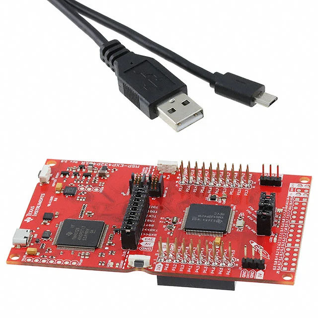

# Embedded Software for the Internet of Things 

This is the repository for the Embedded Software for the Internet of Things (Introduction to Embedded Systems) Course at the [Department of Information Engineering and Computer Science](https://www.disi.unitn.it/), [University of Trento](https://www.unitn.it/en).

# Slides and Materials
## Part 1: Introduction
- Introduction  [[Slides]](Slides/Lecture-1.pdf)
- ARM Cortex Architecture  [[Slides]](Slides/Lecture-2.pdf)
- Embedded Program Development  [[Slides]](Slides/Lecture-3.pdf)
- Interfacing Input/Output [[Slides]](Slides/Lecture-4.pdf)

## Part 2: Introduction to Bare Metal Programming (with MSP432 LaunchPad) 
- Introduction to TI MSP432 Launchpad [[Slides]](Slides/Lecture-5.pdf)
- General Purpose Input/Output (GPIO) [[Slides]](Slides/Lecture-6.pdf)

### Exercises 
- LED Blink Examples [[lab 0]](Labs/lab0-blink)
- Push Button Examples [[lab 1]](Labs/lab1-gpio)
#### Software Development Environment
- Install Texas Instruments [Code Composer Studio version 12.8.1 (TI CCS)](https://www.ti.com/tool/download/CCSTUDIO/12.8.1)
- Select MSP432P401R as the target platform when creating projects.
#### Technical Documentation

- [MSP432P401R Launchpad Manual](MSP432-Docs/slau597f.pdf)
- [MSP432P401R Datasheet](MSP432-Docs/msp432p401r.pdf)
- [MSP432 Technical Reference Manual](MSP432-Docs/slau356i.pdf)
